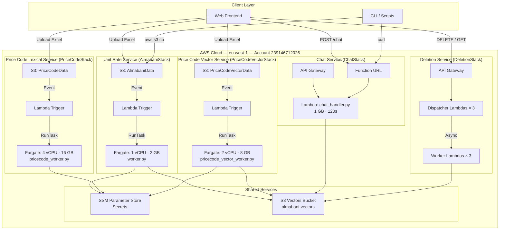
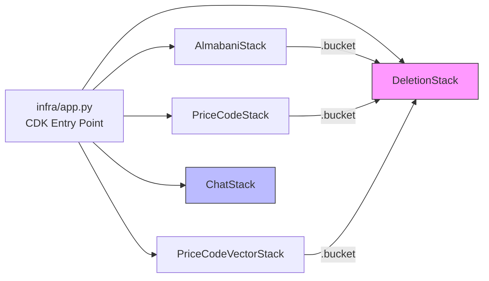
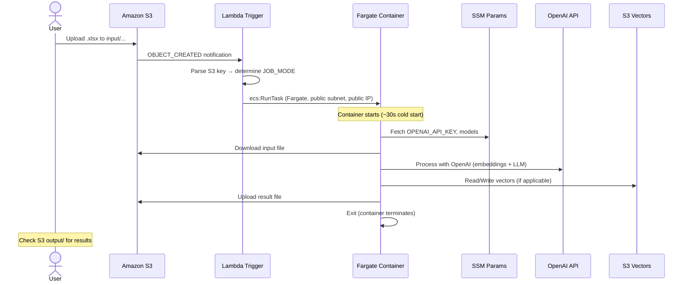
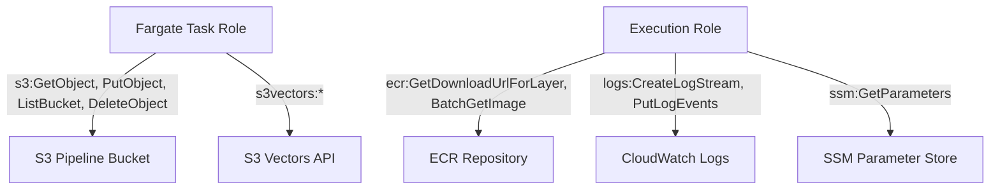
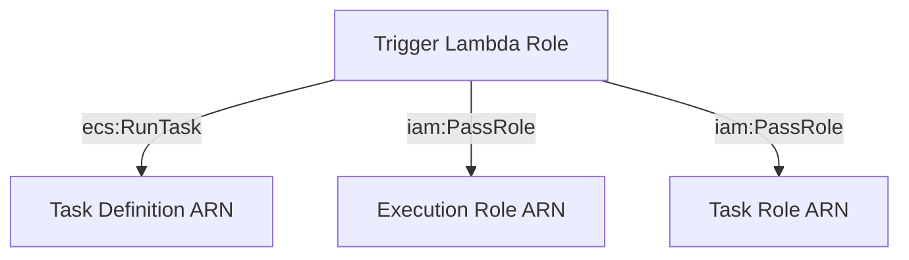
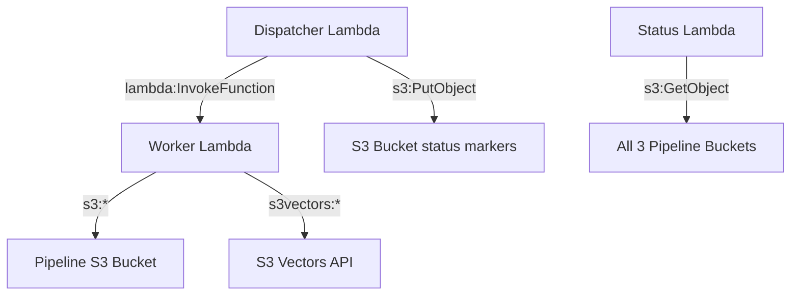

# Almabani BOQ Management System — Project Deployment Guide

**Version:** 2.0  
**Last Updated:** March 2026  
**Target Environment:** AWS (eu-west-1)  
**Account:** 239146712026

---

## 1. Project Overview

The Almabani BOQ Management System is an AI-powered platform that automates three core
construction document workflows:

1. **Unit Rate Processing** — Parse Excel BOQ datasheets and fill missing unit rates
   using embedding-based AI matching
2. **Price Code Allocation (Lexical)** — Match BOQ items to price codes using TF-IDF
   lexical search with LLM-based reranking
3. **Price Code Allocation (Vector)** — Match BOQ items to price codes using OpenAI
   embeddings with similarity search and LLM validation

Additionally, the system provides:
- A **natural language Chat API** for querying rates and codes by description
- An **async Deletion API** for managing indexed data

### Architecture Philosophy

The system uses a **"Process & Die" serverless architecture** — no persistent servers.
When a user uploads a file to S3, the system spins up a container, processes the file,
uploads the result, and terminates. This results in **zero idle cost**.

---

## 2. System Architecture

### High-Level Architecture



### AWS Services Used

| Service | Purpose | Cost Model |
|---------|---------|------------|
| AWS Fargate (ECS) | Batch file processing | Pay-per-second (no idle cost) |
| AWS Lambda | Chat API, deletion, S3 triggers | Pay-per-invocation |
| Amazon S3 | File storage (input/output) | ~$0.02/GB/month |
| S3 Vectors | Managed vector search | Included with S3 |
| SSM Parameter Store | Secrets management | Free (standard tier) |
| API Gateway | REST APIs (chat, deletion) | Pay-per-request |
| ECR | Docker image registry | ~$0.10/GB/month |
| CloudWatch Logs | Monitoring and debugging | ~$0.50/GB ingested |

---

## 3. CDK Stacks Reference

The infrastructure is defined as **5 independent AWS CDK stacks** in the `infra/` directory.

### Stack Summary

| Stack | CDK File | Compute | Key Resources |
|-------|----------|---------|---------------|
| AlmabaniStack | `almabani_stack.py` | Fargate (1 vCPU, 2 GB) | VPC, S3, ECS, Lambda trigger, SSM |
| PriceCodeStack | `pricecode_stack.py` | Fargate (4 vCPU, 16 GB) | VPC, S3, ECS, Lambda trigger, SSM |
| PriceCodeVectorStack | `pricecode_vector_stack.py` | Fargate (2 vCPU, 8 GB) | VPC, S3, ECS, Lambda trigger, SSM |
| ChatStack | `chat_stack.py` | Lambda (1 GB, 120s) | API Gateway, Function URL, Lambda layers |
| DeletionStack | `deletion_stack.py` | Lambda (10s–15m) | API Gateway, 7 Lambdas total |

### Cross-Stack Dependencies



DeletionStack receives S3 bucket references from all 3 pipeline stacks so it can delete
objects across buckets. ChatStack is fully independent.

---

## 4. Event-Driven Processing Flow

### File Processing Pipeline



### S3 Path Routing

Each stack's Lambda trigger inspects the S3 key to determine the job mode:

| S3 Prefix | Stack | JOB_MODE | Worker |
|-----------|-------|----------|--------|
| `input/parse/` | AlmabaniStack | PARSE | `worker.py` |
| `input/fill/` | AlmabaniStack | FILL | `worker.py` |
| `input/pricecode/index/` | PriceCodeStack | INDEX | `pricecode_worker.py` |
| `input/pricecode/allocate/` | PriceCodeStack | ALLOCATE | `pricecode_worker.py` |
| `input/pricecode-vector/index/` | PriceCodeVectorStack | INDEX | `pricecode_vector_worker.py` |
| `input/pricecode-vector/allocate/` | PriceCodeVectorStack | ALLOCATE | `pricecode_vector_worker.py` |

---

## 5. IAM Permissions Model

All permissions are defined in CDK with least-privilege principles.

### Fargate Task Roles

Each Fargate task definition has a **task role** (for application access) and an
**execution role** (for ECR pull + CloudWatch).



### Lambda Trigger Roles



### DeletionStack Permission Chain



### Complete IAM Matrix

| Principal | Action | Resource |
|-----------|--------|----------|
| Fargate Task Role (all stacks) | `s3:GetObject, PutObject, ListBucket, DeleteObject` | Own pipeline bucket |
| Fargate Task Role (all stacks) | `s3vectors:*` | `*` |
| Lambda Trigger (all stacks) | `ecs:RunTask` | Own task definition ARN |
| Lambda Trigger (all stacks) | `iam:PassRole` | Execution + Task role ARNs |
| Chat Lambda | `s3vectors:*` | `*` |
| Deletion Dispatcher | `lambda:InvokeFunction` | Corresponding worker ARN |
| Deletion Dispatcher | `s3:PutObject` | Respective bucket |
| Deletion Worker (Datasheet) | `s3:*` | AlmabaniData bucket |
| Deletion Worker (Datasheet) | `s3vectors:*` | `*` |
| Deletion Worker (PriceCode) | `s3:*` | PriceCodeData bucket |
| Deletion Worker (PriceCode) | `s3vectors:*` | `*` |
| Deletion Worker (PCV) | `s3:*` | PriceCodeVectorData bucket |
| Deletion Worker (PCV) | `s3vectors:*` | `*` |
| Status Lambda | `s3:GetObject` | All 3 pipeline buckets |
| External (taskflow-backend) | `s3:GetObject, PutObject, ListBucket, DeleteObject` | PriceCodeVectorData bucket |

---

## 6. Deployment Procedure

### 6.1 Prerequisites

| Requirement | Minimum Version |
|-------------|----------------|
| Python | 3.11 |
| Node.js | 18 |
| AWS CDK CLI | 2.x (`npm install -g aws-cdk`) |
| Docker | 20+ (for building Fargate images) |
| AWS CLI | v2 (configured with valid credentials) |

### 6.2 Clone and Configure

```bash
# 1. Clone the repository
git clone <repo-url> Almabani
cd Almabani

# 2. Create a Python virtual environment
python3.11 -m venv .venv
source .venv/bin/activate

# 3. Install infrastructure dependencies
pip install -r infra/requirements.txt

# 4. Configure environment variables
cp backend/.env.example backend/env
# Edit backend/env with your actual OPENAI_API_KEY
```

### 6.3 Required Environment Variables

Edit `backend/env` (or `.env` in the project root):

```ini
# REQUIRED — OpenAI API key
OPENAI_API_KEY=sk-...

# Models (these defaults are recommended)
OPENAI_EMBEDDING_MODEL=text-embedding-3-small
OPENAI_CHAT_MODEL=gpt-5-mini-2025-08-07

# S3 Vectors configuration
S3_VECTORS_BUCKET=almabani-vectors
S3_VECTORS_INDEX_NAME=almabani
PRICECODE_INDEX_NAME=almabani-pricecode-vector
```

### 6.4 Bootstrap CDK (First Time Only)

```bash
cdk bootstrap aws://239146712026/eu-west-1 --app "python3 infra/app.py"
```

### 6.5 Deploy All Stacks

```bash
# Deploy everything (interactive — will prompt for IAM changes)
cdk deploy --app "python3 infra/app.py" --all

# For CI/CD (no prompts)
cdk deploy --app "python3 infra/app.py" --all --require-approval never
```

### 6.6 Deploy Individual Stacks

```bash
cdk deploy --app "python3 infra/app.py" AlmabaniStack
cdk deploy --app "python3 infra/app.py" PriceCodeStack
cdk deploy --app "python3 infra/app.py" PriceCodeVectorStack
cdk deploy --app "python3 infra/app.py" ChatStack
cdk deploy --app "python3 infra/app.py" DeletionStack
```

> **Important:** Deploy DeletionStack **after** the 3 pipeline stacks, since it
> receives their S3 bucket references.

### 6.7 Verify Deployment

```bash
# Check all outputs
aws cloudformation describe-stacks --query "Stacks[?starts_with(StackName,'Almabani') || starts_with(StackName,'PriceCode') || starts_with(StackName,'Chat') || starts_with(StackName,'Deletion')].{Stack:StackName,Status:StackStatus}" --output table

# Get Chat Function URL
aws cloudformation describe-stacks --stack-name ChatStack \
  --query "Stacks[0].Outputs[?OutputKey=='ChatFunctionUrl'].OutputValue" --output text

# Warmup test
CHAT_URL=$(aws cloudformation describe-stacks --stack-name ChatStack \
  --query "Stacks[0].Outputs[?OutputKey=='ChatFunctionUrl'].OutputValue" --output text)

curl -s -X POST "$CHAT_URL" \
  -H "Content-Type: application/json" \
  -d '{"message": "warmup", "type": "unitrate"}'
```

---

## 7. Secrets Management

### SSM Parameter Store

Fargate containers fetch secrets from SSM at startup. **No redeployment required** to
update these.

| SSM Path | Used By | Parameters |
|----------|---------|------------|
| `/almabani/OPENAI_API_KEY` | AlmabaniStack | OpenAI API key |
| `/almabani/OPENAI_EMBEDDING_MODEL` | AlmabaniStack | Embedding model name |
| `/almabani/OPENAI_CHAT_MODEL` | AlmabaniStack | Chat model name |
| `/pricecode/OPENAI_API_KEY` | PriceCodeStack | OpenAI API key |
| `/pricecode/OPENAI_EMBEDDING_MODEL` | PriceCodeStack | Embedding model name |
| `/pricecode/OPENAI_CHAT_MODEL` | PriceCodeStack | Chat model name |
| `/pricecode-vector/OPENAI_API_KEY` | PriceCodeVectorStack | OpenAI API key |
| `/pricecode-vector/OPENAI_EMBEDDING_MODEL` | PriceCodeVectorStack | Embedding model name |

### Updating a Secret

```bash
aws ssm put-parameter --name "/almabani/OPENAI_API_KEY" \
  --value "sk-new-key-here" --type String --overwrite
```

### Lambda Environment Variables

ChatStack and DeletionStack receive the OpenAI API key as a Lambda environment variable
set at deploy time. To update:

```bash
# Option 1: Update backend/env and redeploy the stack
cdk deploy --app "python3 infra/app.py" ChatStack

# Option 2: Update Lambda directly (no CDK redeploy)
aws lambda update-function-configuration \
  --function-name <ChatHandler-function-name> \
  --environment "Variables={OPENAI_API_KEY=sk-new-key,...}"
```

---

## 8. API Reference

### 8.1 Chat API (ChatStack)

**Function URL** (recommended — no 29s timeout):
```
POST <ChatFunctionUrl>
```

**API Gateway** (backup — 29s timeout):
```
POST <ChatApiUrl>/chat
```

**Request:**
```json
{
  "message": "HDPE pipe DN200 PN16 supply and install",
  "type": "unitrate"
}
```

`type` can be `"unitrate"` or `"pricecode"`.

**Response (success):**
```json
{
  "status": "success",
  "message": "Found matching items",
  "matches": [
    {
      "code": "PC-1234",
      "description": "Supply and install HDPE pipe DN200 PN16",
      "confidence": 0.95,
      "reference": {
        "sheet_name": "Piping",
        "source_file": "catalog_v3.xlsx"
      }
    }
  ]
}
```

### 8.2 Deletion API (DeletionStack)

**Base URL:** `<DeletionApiUrl>` (from CloudFormation outputs)

| Method | Path | Description |
|--------|------|-------------|
| DELETE | `/files/sheets/{sheet_name}` | Delete unit rate datasheet + vectors |
| DELETE | `/pricecode/sets/{set_name}` | Delete lexical price code set |
| DELETE | `/pricecode-vector/sets/{set_name}` | Delete vector price code set |
| GET | `/deletion-status/{deletion_id}` | Poll deletion status |

**Response (202 Accepted):**
```json
{
  "deletion_id": "ds_1710000000_my_sheet",
  "message": "Delete of 'my_sheet' started",
  "bucket_type": "files"
}
```

---

## 9. Vector Storage

### S3 Vectors Indices

| Index | Bucket | Content | Used By |
|-------|--------|---------|---------|
| `almabani` | `almabani-vectors` | Unit rate items from BOQ datasheets | AlmabaniStack (PARSE/FILL), ChatStack (unitrate) |
| `almabani-pricecode-vector` | `almabani-vectors` | Price code catalog items | PriceCodeVectorStack (INDEX/ALLOCATE), ChatStack (pricecode) |

### Embedding Model

All vectors use **OpenAI text-embedding-3-small** (1536 dimensions).

### Managing Indices

```bash
# List all indices
aws s3vectors list-indexes --index-bucket almabani-vectors

# Check index stats
aws s3vectors get-index --index-bucket almabani-vectors --index-name almabani
```

---

## 10. Docker Images

Each pipeline stack builds its own Docker image from the `backend/` directory.

| Dockerfile | Entrypoint | Stack | Base Image |
|------------|-----------|-------|------------|
| `backend/Dockerfile` | `python3 worker.py` | AlmabaniStack | python:3.11-slim |
| `backend/Dockerfile.pricecode` | `python3 pricecode_worker.py` | PriceCodeStack | python:3.11-slim |
| `backend/Dockerfile.pricecode_vector` | `python3 pricecode_vector_worker.py` | PriceCodeVectorStack | python:3.11-slim |

CDK builds these images locally using Docker and pushes them to ECR automatically
during deployment. Ensure Docker is running before deploying pipeline stacks.

---

## 11. Lambda Layers

| Layer | Stack | Contents | Size |
|-------|-------|----------|------|
| ChatDepsLayer | ChatStack | openai, httpx, multidict, frozenlist, yarl, httpcore | ~29 MB |
| ChatAioDepsLayer | ChatStack | aioboto3, aiobotocore, aiohttp | Shared with DeletionStack |
| DeletionDependenciesLayer | DeletionStack | aioboto3, aiobotocore, aiohttp, boto3 | ~15 MB |

Layer code is stored in:
- `backend/layers/chat_deps/` — ChatStack dependencies
- `infra/layers/deletion_dependencies/` — DeletionStack dependencies

---

## 12. Monitoring and Troubleshooting

### CloudWatch Log Groups

| Service | Log Group Pattern |
|---------|------------------|
| Unit Rate Worker | `/ecs/AlmabaniWorker` |
| PriceCode Lexical Worker | `/ecs/PriceCodeWorker` |
| PriceCode Vector Worker | `/ecs/PriceCodeVectorWorker` |
| Chat Lambda | `/aws/lambda/<ChatHandler>` |
| Deletion Lambdas | `/aws/lambda/<DeletionStack-*>` |

### Viewing Logs

```bash
# Tail Fargate logs in real-time
aws logs tail /ecs/AlmabaniWorker --follow

# View recent Chat Lambda logs
aws logs tail /aws/lambda/ChatStack-ChatHandler --since 1h

# Search for errors
aws logs filter-log-events --log-group-name /ecs/PriceCodeWorker \
  --filter-pattern "ERROR" --start-time $(date -d '1 hour ago' +%s000)
```

### Checking Fargate Tasks

```bash
# List running tasks
aws ecs list-tasks --cluster AlmabaniCluster --desired-status RUNNING

# Check why a task stopped
TASK=$(aws ecs list-tasks --cluster AlmabaniCluster --desired-status STOPPED \
  --query "taskArns[0]" --output text)
aws ecs describe-tasks --cluster AlmabaniCluster --tasks $TASK \
  --query "tasks[0].{status:lastStatus,reason:stoppedReason,exit:containers[0].exitCode}"
```

### Common Issues

| Symptom | Cause | Fix |
|---------|-------|-----|
| Fargate task fails with CannotPullContainerError | Docker image not in ECR | Redeploy the stack |
| Fargate task exits with code 1 | Application error | Check CloudWatch logs |
| Chat Lambda times out | OpenAI API slow / large result set | Use Function URL (120s vs 29s) |
| Permission denied on s3vectors | IAM policy missing | Redeploy the stack |
| S3 Vectors index not found | Index was never created | Run an INDEX job first |

---

## 13. Cost Summary

### Zero Idle Cost Architecture

All compute uses pay-per-use pricing. When no jobs are running, there are **no charges**
for compute.

| Component | Monthly Idle | Per-Job (~5 min) |
|-----------|-------------|-----------------|
| Fargate — Unit Rate (1 vCPU, 2 GB) | $0.00 | ~$0.004 |
| Fargate — PriceCode Lexical (4 vCPU, 16 GB) | $0.00 | ~$0.030 |
| Fargate — PriceCode Vector (2 vCPU, 8 GB) | $0.00 | ~$0.016 |
| Lambda — Chat & Deletion | $0.00 | ~$0.0001 |
| NAT Gateway | $0.00 | N/A |
| S3 Storage | ~$0.02/GB | — |
| ECR Images | ~$0.10/GB | — |
| S3 Vectors | Included with S3 | — |
| OpenAI API | — | ~$0.01–$0.10 per job |

> Public subnets with `assignPublicIp: ENABLED` eliminate the ~$32/month NAT Gateway cost.

---

## 14. Project Structure

```
Almabani/
├── backend/                          # Python application code
│   ├── almabani/                     # Core package (parsers, matchers, config)
│   │   ├── parsers/                  # Excel → JSON parsing
│   │   ├── rate_matcher/             # AI unit rate matching (3-stage)
│   │   ├── pricecode/                # Lexical price code matching (TF-IDF + LLM)
│   │   ├── pricecode_vector/         # Embedding price code matching
│   │   ├── vectorstore/              # S3 Vectors indexing
│   │   ├── core/                     # Shared: embeddings, storage, models
│   │   └── config/                   # Settings, logging
│   ├── worker.py                     # Unit Rate Fargate entrypoint
│   ├── pricecode_worker.py           # PriceCode Lexical Fargate entrypoint
│   ├── pricecode_vector_worker.py    # PriceCode Vector Fargate entrypoint
│   ├── chat_handler.py               # Chat Lambda handler
│   ├── delete_handler.py             # Deletion Lambda handlers
│   ├── Dockerfile                    # Unit Rate container
│   ├── Dockerfile.pricecode          # PriceCode Lexical container
│   ├── Dockerfile.pricecode_vector   # PriceCode Vector container
│   ├── requirements.txt              # Python dependencies
│   ├── .env.example                  # Environment variable template
│   └── layers/                       # Lambda layers
│       └── chat_deps/                # Chat Lambda dependencies
├── infra/                            # AWS CDK infrastructure
│   ├── app.py                        # CDK entry point (instantiates all 5 stacks)
│   ├── almabani_stack.py             # Unit Rate stack
│   ├── pricecode_stack.py            # PriceCode Lexical stack
│   ├── pricecode_vector_stack.py     # PriceCode Vector stack
│   ├── chat_stack.py                 # Chat API stack
│   ├── deletion_stack.py             # Deletion API stack
│   ├── requirements.txt              # CDK dependencies
│   ├── lambdas/                      # Lambda trigger code
│   │   ├── trigger.py                # AlmabaniStack S3 trigger
│   │   ├── pricecode_trigger.py      # PriceCodeStack S3 trigger
│   │   └── pricecode_vector_trigger.py  # PriceCodeVectorStack S3 trigger
│   └── layers/
│       └── deletion_dependencies/    # Deletion Lambda layer
├── docs/                             # Documentation
│   ├── ARCHITECTURE.md               # Full architecture with Mermaid diagrams
│   └── BACKEND_STRUCTURE.md          # Backend code structure reference
├── DEPLOYMENT.md                     # Deployment guide (quick reference)
├── LOCAL_DEV.md                      # Local development setup
└── README.md                         # Project overview
```

---

## 15. Quick Command Reference

```bash
# ─── Deployment ────────────────────────────────────────
cdk deploy --app "python3 infra/app.py" --all           # Deploy all
cdk deploy --app "python3 infra/app.py" ChatStack       # Deploy one stack
cdk diff --app "python3 infra/app.py" --all             # Preview changes
cdk destroy --app "python3 infra/app.py" --all          # Tear down (DANGER)

# ─── Running Jobs ──────────────────────────────────────
aws s3 cp boq.xlsx s3://$BUCKET/input/parse/boq.xlsx    # Parse BOQ
aws s3 cp boq.xlsx s3://$BUCKET/input/fill/boq.xlsx     # Fill rates
aws s3 cp cat.xlsx s3://$PC/input/pricecode/index/cat.xlsx    # Index codes
aws s3 cp boq.xlsx s3://$PC/input/pricecode/allocate/boq.xlsx # Allocate codes

# ─── Chat API ──────────────────────────────────────────
curl -X POST "$CHAT_URL" -H "Content-Type: application/json" \
  -d '{"message": "HDPE DN200 supply and install", "type": "unitrate"}'

# ─── Monitoring ────────────────────────────────────────
aws logs tail /ecs/AlmabaniWorker --follow
aws ecs list-tasks --cluster AlmabaniCluster --desired-status RUNNING

# ─── Secrets ───────────────────────────────────────────
aws ssm put-parameter --name "/almabani/OPENAI_API_KEY" \
  --value "sk-new" --type String --overwrite
```
