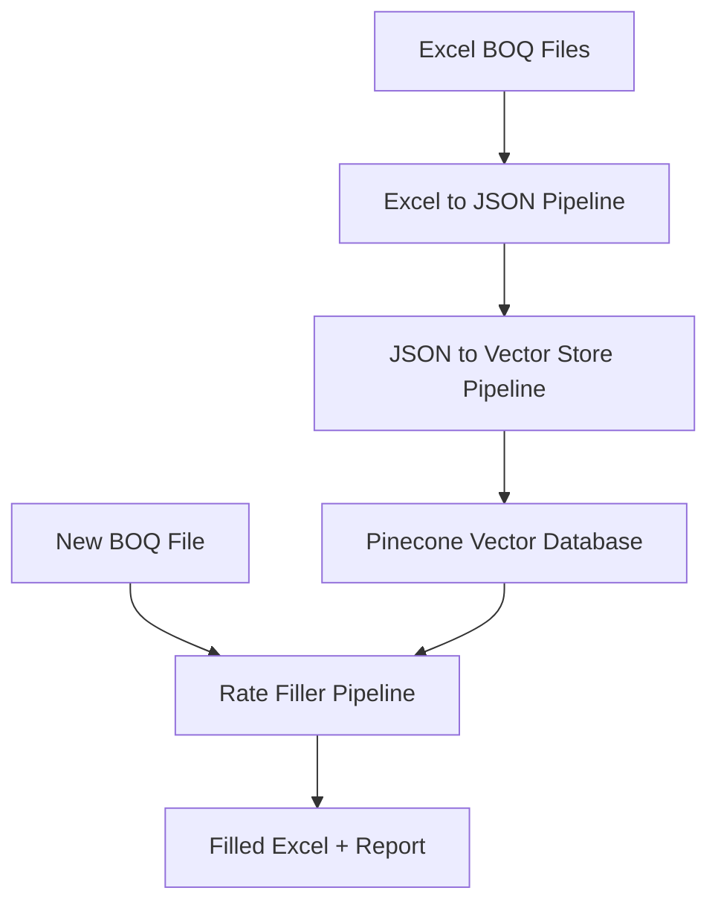

# Almabani BOQ Management System

AI-powered Bill of Quantities (BOQ) processing and auto-rate filling system with three modular pipelines.

## 🎯 Overview

The Almabani system automates the tedious process of filling missing unit rates in construction BOQ files. It uses semantic search and AI validation to find and match similar items from a knowledge base, achieving **80%+ automatic fill rates** with high accuracy.

## 🏗️ System Architecture



**Three Pipelines:**

1. **excel_to_json_pipeline**: Convert Excel BOQ → structured JSON with hierarchy
2. **json_to_vectorstore**: Extract items → generate embeddings → upload to Pinecone
3. **rate_filler_pipeline**: Auto-fill missing rates using semantic search + GPT validation

## ✨ Key Features

- 🤖 **AI-Powered Matching**: Semantic search + GPT-4 validation for accurate matches
- 📊 **Hierarchical Context**: Uses grandparent/parent hierarchy for better accuracy
- 🎨 **Color-Coded Output**: Green for matched, red for unmatched
- 📈 **High Fill Rate**: Typically 80-90% automatic filling
- ⚡ **Fast Processing**: ~10 minutes for 500-item BOQ
- 💰 **Cost Effective**: ~$0.06 per 500-item sheet
- 🔍 **Preview Mode**: Test queries without API costs

## 🚀 Quick Start

### Prerequisites

```bash
# Python 3.8+
python --version

# Install dependencies
pip install -r requirements.txt
```

### Setup API Keys

Create `.env` file in the **root directory**:

```bash
# Copy the example file
cp .env.example .env

# Edit with your API keys
nano .env
```

Add your keys:
```bash
OPENAI_API_KEY=sk-your-key-here
PINECONE_API_KEY=pc-your-key-here
PINECONE_ENVIRONMENT=us-east-1
PINECONE_INDEX_NAME=almabani-boq
```

**All pipelines will use this single `.env` file in the root directory.**

### Initial Setup (One Time)

**Step 1: Convert Master BOQ Files to JSON**

```bash
# Place master BOQ files in excel_to_json_pipeline/input/
cp "Master_BOQ.xlsx" excel_to_json_pipeline/input/

# Convert to JSON
cd excel_to_json_pipeline
python process_separate_sheets.py
```

**Step 2: Build Vector Database**

```bash
# Process JSON files and upload to Pinecone
cd ../json_to_vectorstore
python process_json_to_vectorstore.py
```

This creates a searchable database of ~30,000+ items.

### Daily Usage: Fill New BOQ

```bash
# Place new BOQ file in rate_filler_pipeline/input/
cp "New_Project.xlsx" rate_filler_pipeline/input/

# Fill rates
cd ../rate_filler_pipeline
python process_single.py "New_Project.xlsx" "Terminal"
```

**Output:**
- ✅ Filled Excel file: `output/New_Project_filled_20251110_143000.xlsx`
- 📊 Statistics report: `output/New_Project_filled_20251110_143000_report.txt`

## 📦 Project Structure

```
Almabani/
├── excel_to_json_pipeline/      # Convert Excel → JSON
│   ├── src/                     # Core modules
│   ├── input/                   # Excel files
│   ├── output/                  # Generated JSON
│   ├── process_separate_sheets.py
│   └── README.md
│
├── json_to_vectorstore/         # JSON → Vector Database
│   ├── src/                     # Core modules
│   ├── output/                  # JSONL exports
│   ├── process_json_to_vectorstore.py
│   ├── delete_index.py          # Utility: delete index
│   ├── query_vectorstore.py     # Utility: test queries
│   └── README.md
│
├── rate_filler_pipeline/        # Auto-fill Rates
│   ├── src/                     # Core modules
│   ├── input/                   # BOQ files to fill
│   ├── output/                  # Filled files + reports
│   ├── process_single.py        # Process one file
│   ├── process_folder.py        # Process all files
│   └── README.md
│
├── test_query_preview.py        # Preview tool (no API costs)
├── requirements.txt             # All dependencies
└── README.md                    # This file
```

## 📚 Documentation

Each pipeline has detailed documentation:

- **[Excel to JSON Pipeline](excel_to_json_pipeline/README.md)**: Hierarchy logic, configuration
- **[JSON to Vector Store](json_to_vectorstore/README.md)**: Embedding format, Pinecone setup
- **[Rate Filler Pipeline](rate_filler_pipeline/README.md)**: Matching rules, troubleshooting

## 🔧 Configuration

### Similarity Threshold

Adjust in `rate_filler_pipeline/fill_rates.py`:

```python
similarity_threshold = 0.7  # Lower = more candidates (0.6-0.8 recommended)
```

### LLM Model

Change GPT model in `rate_filler_pipeline/src/rate_matcher.py`:

```python
model = "gpt-5-mini-2025-08-07"  # or "gpt-4o" for better latency
```

### Embedding Format

All pipelines use consistent format:

```
[grandparent] | [parent] | [description]
```

Example:
```
4.1 - Granular Base & Sub base | 4.2 - Cement Treated Base | Cement treated base course to PCC apron, thickness 150mm
```

## 🎯 How It Works

### Hierarchical Matching

The system uses **3-level hierarchy** for context:

```
Excel Structure:
  PART 4 - APRONS (numeric level)
    └─ 4.1 - Granular Base & Sub base (c-level)
        └─ 4.2 - Cement Treated Base (c-level)
            └─ Item 4.2.01: Cement treated base course... (item)

Hierarchy for Item 4.2.01:
  Grandparent: "4.1 - Granular Base & Sub base"
  Parent: "4.2 - Cement Treated Base"
  Description: "Cement treated base course..."
```

### Matching Process

1. **Embed Query**: Generate embedding for `[grandparent] | [parent] | [description]`
2. **Vector Search**: Find top 6 similar items (cosine similarity > 0.7)
3. **LLM Validation**: GPT validates based on 5 matching rules:
   - Core Identity
   - Specifications (thickness, grade, capacity)
   - Scope of Work (supply vs install)
   - Units (m2 vs m3 compatibility)
   - Hierarchical Context
4. **Fill & Format**: Green if matched, red if not

## 💡 Tips & Best Practices

### For Best Results

1. **Populate Vector DB**: More master BOQ files = better matches
2. **Use Preview Tool**: Test queries before spending API credits
3. **Adjust Thresholds**: Lower for more matches, higher for stricter
4. **Review Red Cells**: Manually fill items that couldn't be matched
5. **Update DB Regularly**: Re-run json_to_vectorstore when adding new master BOQs

### Cost Optimization

```bash
# Preview queries first (free)
python test_query_preview.py input/file.xlsx "Sheet" 20

# Process only specific sheet (not all)
python process_single.py "file.xlsx" "Terminal"

# Use gpt-4o-mini instead of gpt-4o (10x cheaper)
```

### Performance Tuning

```python
# In rate_matcher.py

# More candidates = better chance but slower
top_k = 6  # Try 8-10 for difficult items

# Stricter threshold = fewer but better matches
similarity_threshold = 0.75  # Try 0.7-0.8

# Higher confidence = only very certain matches
confidence_threshold = 0.8  # Try 0.7-0.9
```

## 🐛 Troubleshooting

### Common Issues

**No matches found?**
```bash
# Check vector database is populated
cd json_to_vectorstore
python query_vectorstore.py "test query"

# Lower similarity threshold
# Edit rate_filler_pipeline/fill_rates.py: similarity_threshold = 0.6
```

**Wrong hierarchy extracted?**
```bash
# Preview hierarchy extraction
python test_query_preview.py input/file.xlsx "Sheet" 10

# Check c-levels are marked correctly in Excel
# Verify consecutive c-levels create proper parent-child
```

**API rate limits?**
```bash
# Automatic rate limiting is included
# If still hitting limits, increase delays in rate_matcher.py
```

**Vector DB out of sync?**
```bash
# Rebuild from scratch
cd json_to_vectorstore
python delete_index.py  # Confirm deletion
python process_json_to_vectorstore.py  # Rebuild
```

## 📊 Performance Metrics

**Typical Results:**
- Fill Rate: 80-90%
- Accuracy: 95%+ (for matched items)
- Processing Speed: ~10 minutes per 500-item sheet
- Cost: $0.06 per 500-item sheet

**Vector Database:**
- ~30,000 items (from master BOQs)
- Dimension: 1536 (OpenAI text-embedding-3-small)
- Index: Pinecone serverless (AWS us-east-1)

## 🔄 Workflow Example

**Monthly Workflow:**

```bash
# 1. New master BOQ received → Add to knowledge base
cp "New_Master_2025.xlsx" excel_to_json_pipeline/input/
cd excel_to_json_pipeline && python process_separate_sheets.py

# 2. Update vector database
cd ../json_to_vectorstore && python process_json_to_vectorstore.py

# 3. Fill new project BOQs (as needed)
cd ../rate_filler_pipeline
python process_single.py "Project_A.xlsx" "Terminal"
python process_single.py "Project_B.xlsx" "Apron"
```

## 🛠️ Development

### Run Tests

```bash
# Test each pipeline individually
cd excel_to_json_pipeline && python process_separate_sheets.py
cd ../json_to_vectorstore && python query_vectorstore.py "test"
cd ../rate_filler_pipeline && python ../test_query_preview.py input/Book_2.xlsx "9-PA" 5
```

### Add Custom Logic

- **Hierarchy processing**: `excel_to_json_pipeline/src/hierarchy_processor.py`
- **Matching rules**: `rate_filler_pipeline/src/rate_matcher.py`
- **Output formatting**: `rate_filler_pipeline/src/excel_writer.py`

## 📄 License

Internal use only - Almabani Company

## 👥 Support

For issues or questions:
1. Check individual pipeline READMEs
2. Review troubleshooting sections
3. Check logs in each pipeline's `logs/` directory
