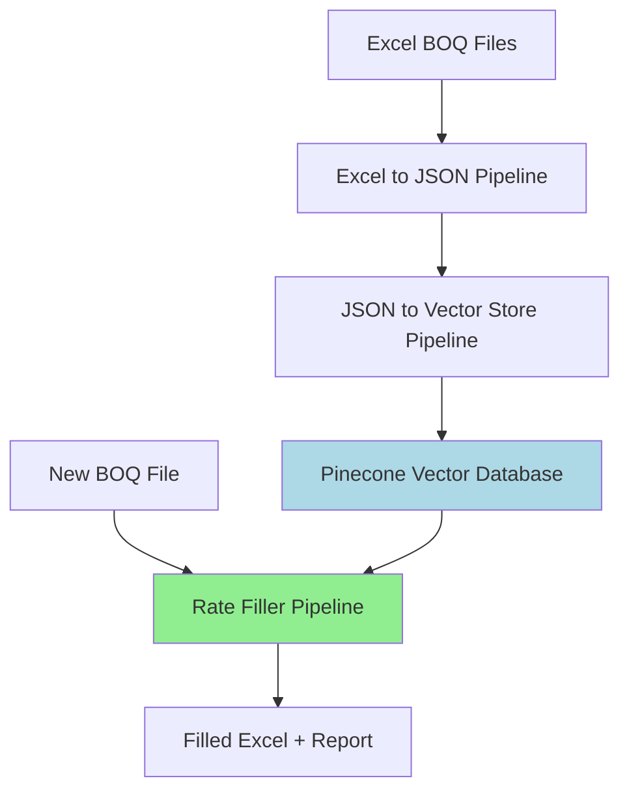

# Almabani BOQ Management System

AI-powered Bill of Quantities (BOQ) processing and auto-rate filling system with three modular pipelines.

## 🎯 Overview

The Almabani system automates the tedious process of filling missing unit rates in construction BOQ files. It uses semantic search and a sophisticated 3-stage AI validation process to find and match similar items from a knowledge base, achieving **80%+ automatic fill rates** with high accuracy and nuanced matching (exact, close, or approximation).

## 🏗️ System Architecture



**Three Pipelines:**

1. **excel_to_json_pipeline**: Convert Excel BOQ → structured JSON with hierarchy
2. **json_to_vectorstore**: Extract items → generate embeddings → upload to Pinecone
3. **rate_filler_pipeline**: Auto-fill missing rates using semantic search + 3-stage GPT validation

## ✨ Key Features

- 🤖 **3-Stage AI Matching**: Sequential LLM validation with specialized prompts
  - **Stage 1 (Matcher)**: Strict exact match detection (100% confidence)
  - **Stage 2 (Expert)**: Close matches with minor differences (70-95% confidence)
  - **Stage 3 (Estimator)**: Approximations for cost estimation (50-69% confidence)
- 📊 **Hierarchical Context**: Uses grandparent/parent hierarchy for better accuracy
- 🎨 **4-Color Coding**: Green (exact), Yellow (close), Blue (approximation), Red (no match)
- 📈 **High Fill Rate**: Typically 80-90% automatic filling with confidence levels
- ⚡ **Fast Processing**: ~10 minutes for 500-item BOQ with early-return optimization
- 💰 **Cost Effective**: ~$0.08 per 500-item sheet (saves on wasteful LLM calls)
- � **Auto-Created Columns**: Reference and Reasoning columns for full transparency
- 🔍 **LLM-Calculated Rates**: For approximations, LLM applies scaling logic and returns calculated rates

## 🚀 Quick Start

### Prerequisites

```bash
# Python 3.8+
python --version

# Install dependencies
pip install -r requirements.txt
```

### Setup API Keys

Create `.env` file in the **root directory** (`/Almabani/.env`):

```bash
# Copy the example file
cp .env.example .env

# Edit with your API keys
nano .env
```

Add your keys:
```bash
OPENAI_API_KEY=sk-your-key-here
PINECONE_API_KEY=pc-your-key-here
```

**All three pipelines use this single `.env` file in the root directory.**

### Initial Setup (One Time)

**Step 1: Convert Master BOQ Files to JSON**

```bash
# Place master BOQ files in excel_to_json_pipeline/input/
cp "Master_BOQ.xlsx" excel_to_json_pipeline/input/

# Convert to JSON
cd excel_to_json_pipeline
python process_separate_sheets.py
```

**Step 2: Build Vector Database**

```bash
# Process JSON files and upload to Pinecone
cd ../json_to_vectorstore
python process_json_to_vectorstore.py
```

This creates a searchable database of ~30,000+ items.

### Daily Usage: Fill New BOQ

```bash
# Place new BOQ file in rate_filler_pipeline/input/
cp "New_Project.xlsx" rate_filler_pipeline/input/

# Fill rates
cd ../rate_filler_pipeline
python process_single.py "New_Project.xlsx" "Terminal"
```

**Output:**
- ✅ Filled Excel file: `output/New_Project_filled_20251110_143000.xlsx`
- 📊 Statistics report: `output/New_Project_filled_20251110_143000_report.txt`

## 📦 Project Structure

```
Almabani/
├── excel_to_json_pipeline/      # Convert Excel → JSON
│   ├── src/                     # Core modules
│   ├── input/                   # Excel files
│   ├── output/                  # Generated JSON
│   ├── process_separate_sheets.py
│   └── README.md
│
├── json_to_vectorstore/         # JSON → Vector Database
│   ├── src/                     # Core modules
│   ├── output/                  # JSONL exports
│   ├── process_json_to_vectorstore.py
│   ├── delete_index.py          # Utility: delete index
│   ├── query_vectorstore.py     # Utility: test queries
│   └── README.md
│
├── rate_filler_pipeline/        # Auto-fill Rates
│   ├── src/                     # Core modules
│   │   ├── prompts.py           # 3-stage LLM prompts
│   │   ├── rate_matcher.py      # Sequential matching logic
│   │   ├── excel_reader.py      # Read Excel files
│   │   └── excel_writer.py      # Write with color coding
│   ├── input/                   # BOQ files to fill
│   ├── output/                  # Filled files + reports
│   ├── process_single.py        # Process one file
│   ├── process_folder.py        # Process all files
│   ├── test_query_preview.py    # Preview tool (no API costs)
│   └── README.md
│
├── .env                         # API keys (single file for all pipelines)
├── .env.example                 # Template for .env
├── requirements.txt             # All dependencies
└── README.md                    # This file
```

## 📚 Documentation

Each pipeline has detailed documentation:

- **[Excel to JSON Pipeline](excel_to_json_pipeline/README.md)**: Hierarchy logic, configuration
- **[JSON to Vector Store](json_to_vectorstore/README.md)**: Embedding format, Pinecone setup
- **[Rate Filler Pipeline](rate_filler_pipeline/README.md)**: Matching rules, troubleshooting

## 🔧 Configuration

### Similarity Threshold

Adjust in `rate_filler_pipeline/fill_rates.py`:

```python
similarity_threshold = 0.7  # Lower = more candidates (0.6-0.8 recommended)
```

### LLM Model

Change GPT model in `rate_filler_pipeline/src/rate_matcher.py`:

```python
model = "gpt-5-mini-2025-08-07"  # or "gpt-4o" for better latency
```

### Embedding Format

All pipelines use consistent format:

```
[grandparent] | [parent] | [description]
```

Example:
```
4.1 - Granular Base & Sub base | 4.2 - Cement Treated Base | Cement treated base course to PCC apron, thickness 150mm
```

## 🎯 How It Works

### 3-Stage Matching Process

The rate filler uses a sophisticated sequential approach with specialized LLM agents:

```
Item needs filling
    ↓
Vector Search (top 6 similar candidates)
    ↓
┌─────────────────────────────────┐
│  Stage 1: MATCHER               │
│  - Strict exact matching only   │
│  - Temperature: 0                │
│  - Confidence: 100%              │
└─────────────────────────────────┘
    ↓
Exact match? ──YES──→ ✓ Fill (Green) ← DONE
    │
    NO
    ↓
┌─────────────────────────────────┐
│  Stage 2: EXPERT                │
│  - Close match detection        │
│  - Temperature: 0                │
│  - Confidence: 70-95%            │
│  - Notes differences             │
└─────────────────────────────────┘
    ↓
Close match? ──YES──→ ≈ Fill (Yellow) ← DONE
    │
    NO
    ↓
┌─────────────────────────────────┐
│  Stage 3: ESTIMATOR             │
│  - Approximation detection      │
│  - LLM calculates adjusted rate │
│  - Temperature: 0                │
│  - Confidence: 50-69%            │
│  - Provides adjustment logic    │
└─────────────────────────────────┘
    ↓
Approximation? ──YES──→ ~ Fill (Blue) ← DONE
    │
    NO
    ↓
✗ Not Filled (Red)
```

**Key Benefits:**
- **Early Returns**: Exact matches skip Expert and Estimator stages (saves LLM costs)
- **Specialized Prompts**: Each stage has different strictness and criteria
- **Transparency**: User sees which stage matched and why
- **Practical**: Provides approximations when exact/close matches unavailable

### Hierarchical Matching

The system uses **3-level hierarchy** for context:

```
Excel Structure:
  PART 4 - APRONS (numeric level)
    └─ 4.1 - Granular Base & Sub base (c-level)
        └─ 4.2 - Cement Treated Base (c-level)
            └─ Item 4.2.01: Cement treated base course... (item)

Hierarchy for Item 4.2.01:
  Grandparent: "4.1 - Granular Base & Sub base"
  Parent: "4.2 - Cement Treated Base"
  Description: "Cement treated base course..."
```

### Complete Matching Process

1. **Embed Query**: Generate embedding for `[grandparent] | [parent] | [description]`
2. **Vector Search**: Find top 6 similar items (cosine similarity > 0.5)
3. **Stage 1 - Matcher**: Check for exact matches
   - IDENTICAL specifications required
   - Any difference → proceed to Stage 2
   - Match → Return (Green, 100% confidence)
4. **Stage 2 - Expert**: Check for close matches
   - Very similar with minor differences
   - Confidence 70-95%
   - Match → Return (Yellow, with differences noted)
5. **Stage 3 - Estimator**: Check for approximations
   - Similar enough for cost estimation
   - Confidence 50-69%
   - Match → Return (Blue, with adjustment guidance)
6. **Fill & Format**: 
   - Green cells: Exact matches (MATCHER)
   - Yellow cells: Close matches (EXPERT)
   - Blue cells: Approximations (ESTIMATOR)
   - Red cells: No match in any stage

### Excel Output

**Auto-Created Columns:**
- **AutoRate Reference**: Source item with hierarchy and confidence
  - Example: `"General Excavation | Apron area | Depth 0.25m [terminal-45@125.50] (Confidence: 87%)"`
- **AutoRate Reasoning**: LLM's explanation
  - Exact: "Identical specifications and scope"
  - Close: "Very similar, differences: DN200 vs DN250"
  - Approximation: "Candidate DN250@500.00: scaled by diameter ratio (200/250) = 400.00. Limitations: different size class"

**Color Meaning:**
- 🟢 Green: Use confidently (exact match)
- 🟡 Yellow: Review differences (close match)
- 🔵 Blue: Use for budgeting, verify before final pricing (approximation)
- 🔴 Red: Requires manual entry (no match)

## 💡 Tips & Best Practices

### For Best Results

1. **Populate Vector DB**: More master BOQ files = better matches
2. **Review Output Colors**: 
   - Green (exact): Use confidently
   - Yellow (close): Check differences in Reasoning column
   - Blue (approximation): Read adjustment guidance carefully
   - Red (no match): Manual entry required
3. **Adjust Thresholds**: Lower similarity threshold for more matches
4. **Customize Prompts**: Edit `src/prompts.py` for domain-specific rules
5. **Update DB Regularly**: Re-run json_to_vectorstore when adding new master BOQs

### Cost Optimization

```bash
# Process only specific sheet (not all)
python process_single.py "file.xlsx" "Terminal"

# Sequential stages save costs:
# - Exact matches skip Expert and Estimator calls
# - Typical: ~60-70% exact → only 30-40% need all 3 stages
```

### Performance Tuning

```python
# In fill_rates.py or when calling run_pipeline()

# More candidates = better chance but slower
top_k = 6  # Try 8-10 for difficult items

# Lower threshold = more candidates retrieved
similarity_threshold = 0.5  # Try 0.4-0.6 if too many red cells

# Customize stage behavior in src/prompts.py:
# - build_matcher_prompt(): Adjust exact match strictness
# - build_expert_prompt(): Change confidence ranges (70-95%)
# - build_estimator_prompt(): Modify approximation criteria (50-69%)
```

## 🐛 Troubleshooting

### Common Issues

**No matches found (too many red cells)?**
```bash
# Lower similarity threshold
python process_single.py "file.xlsx" "Sheet" --threshold 0.4

# Increase top-k candidates
python process_single.py "file.xlsx" "Sheet" --top-k 10

# Check vector database has data
cd json_to_vectorstore
python query_vectorstore.py "test query"
```

**Too many approximations (blue cells)?**
```bash
# Make Expert stage more lenient (edit src/prompts.py)
# Change Expert confidence range from 70-95% to 65-95%

# Or make Matcher less strict to catch more exact matches
```

**Wrong matches?**
```bash
# Tighten Matcher stage (edit src/prompts.py)
# Add more specific matching criteria

# Review prompts for domain-specific rules
# Check hierarchy extraction in logs
```

**Vector DB out of sync?**
```bash
# Rebuild from scratch
cd json_to_vectorstore
python delete_index.py  # Confirm deletion
python process_json_to_vectorstore.py  # Rebuild
```

## 📊 Performance Metrics

**Typical Results:**
- Fill Rate: 80-90% (combined exact + close + approximation)
  - Exact (Green): ~60-70%
  - Close (Yellow): ~15-20%
  - Approximation (Blue): ~3-5%
  - Not filled (Red): ~10-20%
- Accuracy: 95%+ for exact matches, 85%+ for close matches
- Processing Speed: ~10 minutes per 500-item sheet
- Cost: $0.08-0.10 per 500-item sheet (sequential stages reduce wasteful LLM calls)

**Vector Database:**
- ~30,000 items (from master BOQs)
- Dimension: 1536 (OpenAI text-embedding-3-small)
- Index: Pinecone serverless (AWS us-east-1)
- Model: gpt-4o-mini (temperature=0 for all stages)

## 🔄 Workflow Example

**Monthly Workflow:**

```bash
# 1. New master BOQ received → Add to knowledge base
cp "New_Master_2025.xlsx" excel_to_json_pipeline/input/
cd excel_to_json_pipeline && python process_separate_sheets.py

# 2. Update vector database
cd ../json_to_vectorstore && python process_json_to_vectorstore.py

# 3. Fill new project BOQs (as needed)
cd ../rate_filler_pipeline
python process_single.py "Project_A.xlsx" "Terminal"
python process_single.py "Project_B.xlsx" "Apron"
```

## 🛠️ Development

### Run Tests

```bash
# Test each pipeline individually
cd excel_to_json_pipeline && python process_separate_sheets.py
cd ../json_to_vectorstore && python query_vectorstore.py "test"
cd ../rate_filler_pipeline && python test_query_preview.py input/Book_2.xlsx "9-PA" 5
```

### Add Custom Logic

- **Hierarchy processing**: `excel_to_json_pipeline/src/hierarchy_processor.py`
- **3-stage prompts**: `rate_filler_pipeline/src/prompts.py`
  - `build_matcher_prompt()`: Exact match criteria
  - `build_expert_prompt()`: Close match criteria and confidence ranges
  - `build_estimator_prompt()`: Approximation criteria and adjustment guidance
- **Matching logic**: `rate_filler_pipeline/src/rate_matcher.py`
- **Output formatting**: `rate_filler_pipeline/src/excel_writer.py`

## 📄 License

Internal use only - Almabani Company

## 👥 Support

For issues or questions:
1. Check individual pipeline READMEs
2. Review troubleshooting sections
3. Check logs in each pipeline's `logs/` directory
