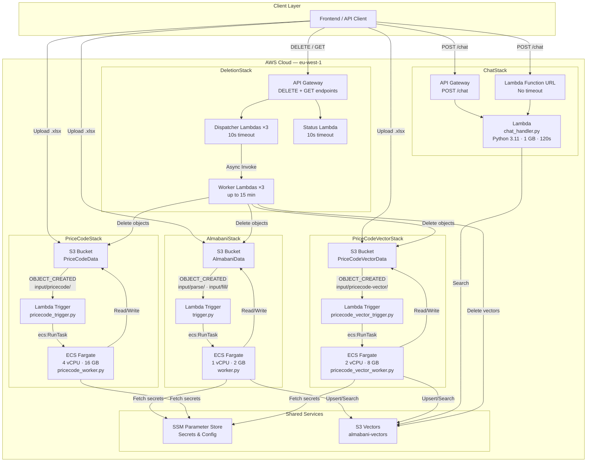
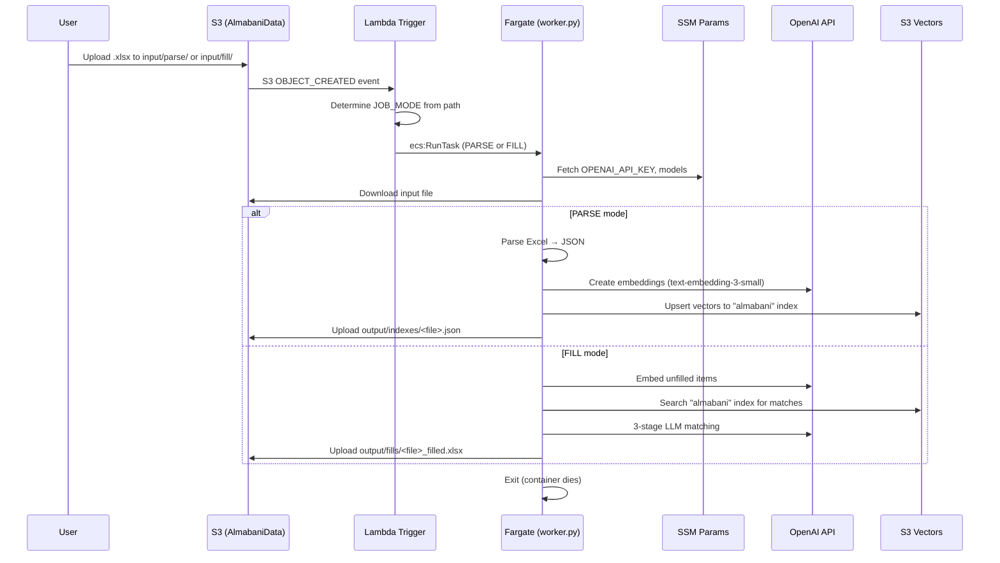
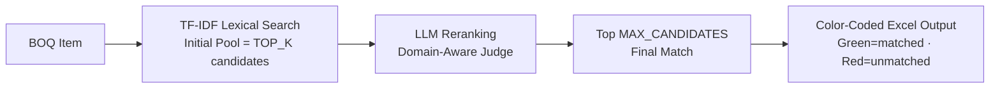
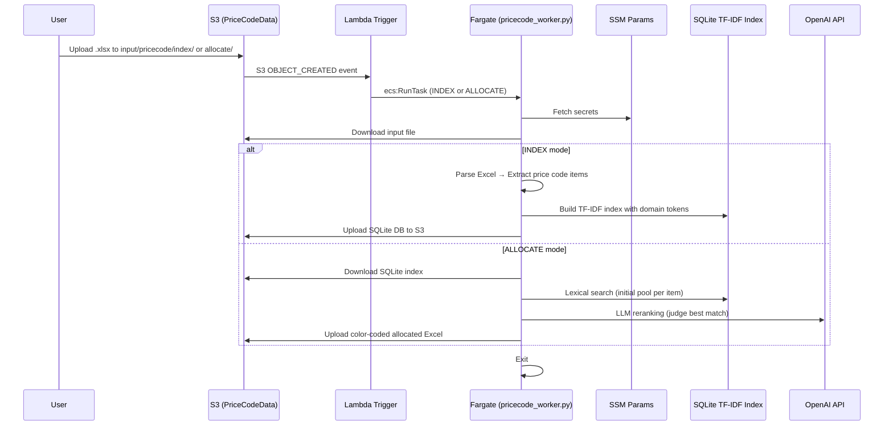
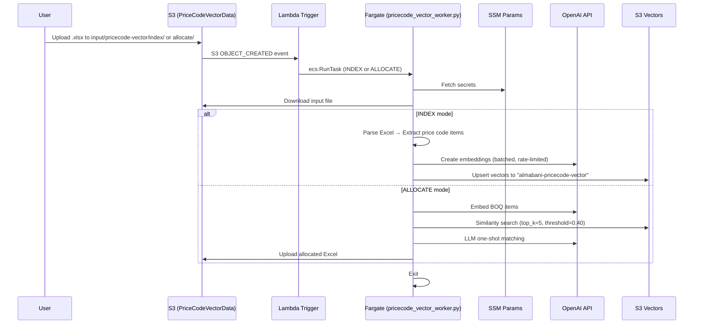
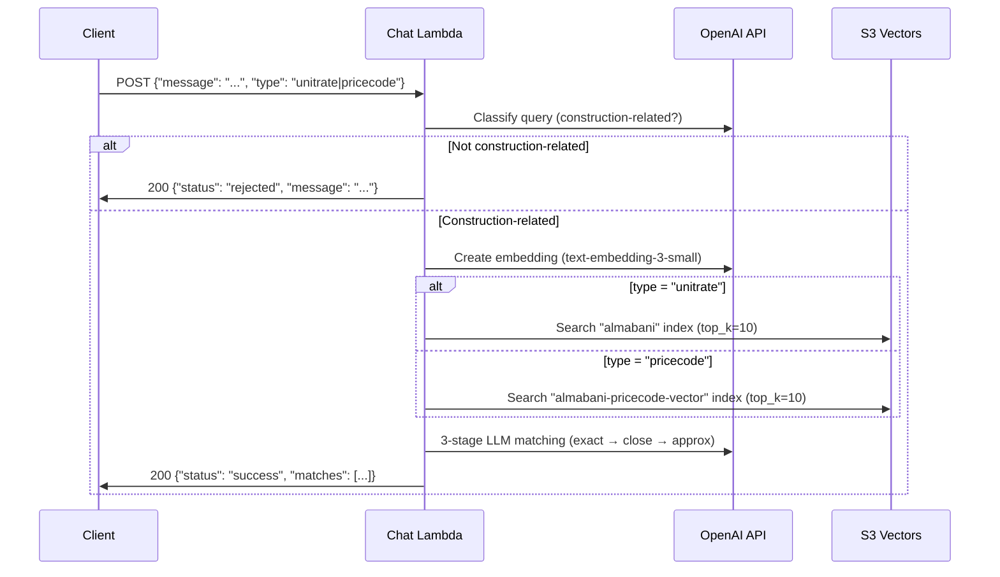
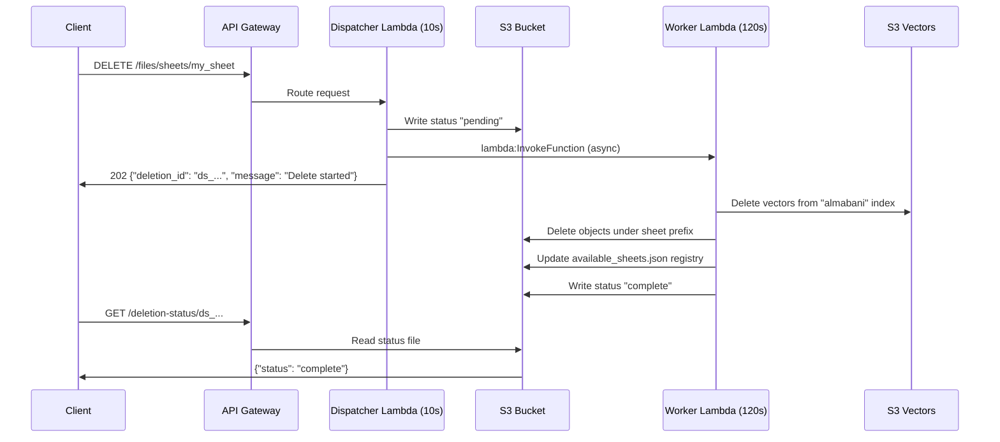
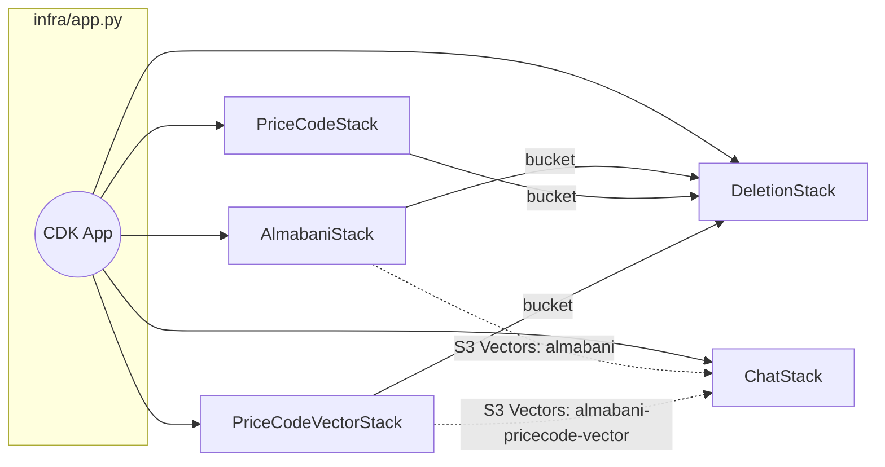

# Almabani BOQ Management System — Architecture

## Overview

Almabani is an AI-powered **Bill of Quantities (BOQ) Management System** built on a
**serverless, event-driven "Process & Die" architecture** on AWS. There are no persistent
servers — compute spins up on demand, processes the job, uploads results, and terminates.

The system is deployed as **5 independent AWS CDK stacks**, each self-contained with its
own compute, triggers, permissions, and API endpoints.

---

## System Overview Diagram

---

## Service 1 — AlmabaniStack (Unit Rate Processing)

Parses Excel BOQ datasheets into structured JSON **and** fills missing unit rates
using AI-powered 3-stage matching (exact → close → approximation).

### Resources

| Resource | Type | Configuration |
|----------|------|---------------|
| VPC | `ec2.Vpc` | 2 AZs, public subnets only, 0 NAT Gateways |
| S3 Bucket | `s3.Bucket` | CORS enabled, auto-delete on stack destroy |
| ECS Cluster | `ecs.Cluster` | Fargate capacity provider |
| Fargate Task | `ecs.FargateTaskDefinition` | **1 vCPU, 2 GB RAM** |
| Docker Image | `Dockerfile` → `worker.py` | Python 3.11-slim, non-root |
| Lambda Trigger | `trigger.py` | Python 3.9, 30s timeout |
| SSM Params | `/almabani/*` | `OPENAI_API_KEY`, `OPENAI_EMBEDDING_MODEL`, `OPENAI_CHAT_MODEL` |

### S3 Path Routing

| Upload Path | JOB_MODE | Output |
|-------------|----------|--------|
| `input/parse/<file>.xlsx` | `PARSE` | `output/indexes/<file>.json` |
| `input/fill/<file>.xlsx` | `FILL` | `output/fills/<file>_filled.xlsx` |

### Flow Diagram

### IAM Permissions

| Principal | Action | Resource |
|-----------|--------|----------|
| Fargate Task Role | `s3:GetObject`, `s3:PutObject`, `s3:ListBucket`, `s3:DeleteObject` | AlmabaniData bucket |
| Fargate Task Role | `s3vectors:*` | `*` (S3 Vectors API) |
| Lambda Trigger | `ecs:RunTask` | Task Definition ARN |
| Lambda Trigger | `iam:PassRole` | Execution Role ARN, Task Role ARN |

---

## Service 2 — PriceCodeStack (Lexical Price Code Allocation)

Indexes price code reference catalogs into a SQLite TF-IDF lexical index, then
allocates price codes to BOQ items using lexical search + LLM reranking.

### Resources

| Resource | Type | Configuration |
|----------|------|---------------|
| VPC | `ec2.Vpc` | 2 AZs, public subnets only, 0 NAT Gateways |
| S3 Bucket | `s3.Bucket` | CORS enabled, auto-delete |
| ECS Cluster | `ecs.Cluster` | Fargate capacity provider |
| Fargate Task | `ecs.FargateTaskDefinition` | **4 vCPU, 16 GB RAM** |
| Docker Image | `Dockerfile.pricecode` → `pricecode_worker.py` | Python 3.11-slim |
| Lambda Trigger | `pricecode_trigger.py` | Python 3.9, 30s timeout |
| SSM Params | `/pricecode/*` | `OPENAI_API_KEY`, `OPENAI_EMBEDDING_MODEL`, `OPENAI_CHAT_MODEL` |

### S3 Path Routing

| Upload Path | JOB_MODE | Output |
|-------------|----------|--------|
| `input/pricecode/index/<file>.xlsx` | `INDEX` | SQLite DB stored in S3 |
| `input/pricecode/allocate/<file>.xlsx` | `ALLOCATE` | `output/pricecode/<file>_allocated.xlsx` |

### Lexical Search Pipeline

**Key parameters:**
- `PRICECODE_MAX_CONCURRENT` — Max concurrent DB queries (default: 200)
- `PRICECODE_MAX_CANDIDATES` — Final candidates after reranking (default: 1)
- `PRICECODE_BATCH_SIZE` — Items per processing batch (default: 100)

### Flow Diagram

### IAM Permissions

| Principal | Action | Resource |
|-----------|--------|----------|
| Fargate Task Role | `s3:GetObject`, `s3:PutObject`, `s3:ListBucket`, `s3:DeleteObject` | PriceCodeData bucket |
| Fargate Task Role | `s3vectors:*` | `*` (S3 Vectors API) |
| Lambda Trigger | `ecs:RunTask` | Task Definition ARN |
| Lambda Trigger | `iam:PassRole` | Execution Role ARN, Task Role ARN |

---

## Service 3 — PriceCodeVectorStack (Embedding Price Code Allocation)

Indexes price code catalogs into S3 Vectors using OpenAI embeddings, then allocates
codes using embedding similarity + LLM validation.

### Resources

| Resource | Type | Configuration |
|----------|------|---------------|
| VPC | `ec2.Vpc` | 2 AZs, public subnets only, 0 NAT Gateways |
| S3 Bucket | `s3.Bucket` | CORS enabled, auto-delete |
| ECS Cluster | `ecs.Cluster` | Fargate capacity provider |
| Fargate Task | `ecs.FargateTaskDefinition` | **2 vCPU, 8 GB RAM** |
| Docker Image | `Dockerfile.pricecode_vector` → `pricecode_vector_worker.py` | Python 3.11-slim |
| Lambda Trigger | `pricecode_vector_trigger.py` | Python 3.9, 30s timeout |
| SSM Params | `/pricecode-vector/*` | `OPENAI_API_KEY`, `OPENAI_EMBEDDING_MODEL` |
| S3 Vectors Index | `almabani-pricecode-vector` | 1536 dimensions |

### S3 Path Routing

| Upload Path | JOB_MODE | Output |
|-------------|----------|--------|
| `input/pricecode-vector/index/<file>.xlsx` | `INDEX` | Embeddings → S3 Vectors |
| `input/pricecode-vector/allocate/<file>.xlsx` | `ALLOCATE` | `output/pricecode-vector/<file>_allocated.xlsx` |

### Flow Diagram

**Key parameters:**
- `PRICECODE_VECTOR_TOP_K` — Candidates per similarity query (default: 5)
- `PRICECODE_VECTOR_THRESHOLD` — Minimum cosine similarity (default: 0.40)
- `BATCH_SIZE` — Items per embedding batch (default: 500)
- `EMBEDDINGS_RPM` — Rate limit for OpenAI embeddings API (default: 3000)

### IAM Permissions

| Principal | Action | Resource |
|-----------|--------|----------|
| Fargate Task Role | `s3:GetObject`, `s3:PutObject`, `s3:ListBucket`, `s3:DeleteObject` | PriceCodeVectorData bucket |
| Fargate Task Role | `s3vectors:*` | `*` (S3 Vectors API) |
| Lambda Trigger | `ecs:RunTask` | Task Definition ARN |
| Lambda Trigger | `iam:PassRole` | Execution Role ARN, Task Role ARN |
| External Role | `s3:GetObject`, `s3:PutObject`, `s3:ListBucket`, `s3:DeleteObject` | Bucket (for `taskflow-backend-dev` Lambda) |

---

## Service 4 — ChatStack (Natural Language Chat API)

Provides a natural language interface for querying unit rates and price codes
via OpenAI embeddings + S3 Vectors + LLM matching.

### Resources

| Resource | Type | Configuration |
|----------|------|---------------|
| Lambda | `lambda.Function` | Python 3.11, **1 GB RAM, 120s timeout** |
| Lambda Layers | `ChatDepsLayer` | openai, httpx, multidict, frozenlist, yarl |
| Lambda Layers | `ChatAioDepsLayer` | aioboto3, aiobotocore, aiohttp |
| API Gateway | `apigw.RestApi` | POST `/chat`, CORS, 29s timeout |
| Function URL | `FunctionUrl` | No timeout limit (recommended) |

### Endpoints

| Method | Endpoint | Timeout | Notes |
|--------|----------|---------|-------|
| POST | `<ChatFunctionUrl>` | None (Lambda limit: 120s) | **Recommended** |
| POST | `<ChatApiUrl>/chat` | 29s (API Gateway limit) | Backup |

### Chat Flow

### IAM Permissions

| Principal | Action | Resource |
|-----------|--------|----------|
| Chat Lambda | `s3vectors:*` | `*` (S3 Vectors API) |

> **Note:** OpenAI API key is passed as a Lambda environment variable at deploy time.

---

## Service 5 — DeletionStack (Data Management API)

Async deletion of datasheets and price code sets. Uses a dispatcher/worker
pattern: dispatcher returns 202 immediately, worker runs in the background.

### Resources

| Resource | Type | Configuration |
|----------|------|---------------|
| Dispatcher Lambdas (×3) | `lambda.Function` | Python 3.11, 10s timeout |
| Worker Lambdas (×3) | `lambda.Function` | Python 3.11, 120s–15 min timeout |
| Status Lambda (×1) | `lambda.Function` | Python 3.11, 10s timeout |
| Lambda Layer | `DeletionDependenciesLayer` | aioboto3, aiobotocore, aiohttp |
| API Gateway | `apigw.RestApi` | DELETE + GET, full CORS |

### API Endpoints

| Method | Path | Handler | Description |
|--------|------|---------|-------------|
| DELETE | `/files/sheets/{sheet_name}` | Dispatcher → Worker | Delete unit rate datasheet + vectors |
| DELETE | `/pricecode/sets/{set_name}` | Dispatcher → Worker | Delete lexical price code set |
| DELETE | `/pricecode-vector/sets/{set_name}` | Dispatcher → Worker | Delete vector price code set |
| GET | `/deletion-status/{deletion_id}` | Status Lambda | Poll status (auto-cleanup on read) |

### Async Deletion Flow

### IAM Permissions

| Principal | Action | Resource |
|-----------|--------|----------|
| Worker (Datasheet) | `s3:*` on bucket | AlmabaniData bucket |
| Worker (Datasheet) | `s3vectors:*` | `*` |
| Worker (PriceCode) | `s3:*` on bucket | PriceCodeData bucket |
| Worker (PriceCode) | `s3vectors:*` | `*` |
| Worker (PCV) | `s3:*` on bucket | PriceCodeVectorData bucket |
| Worker (PCV) | `s3vectors:*` | `*` |
| Dispatcher | `lambda:InvokeFunction` | Corresponding Worker ARN |
| Dispatcher | `s3:PutObject` | Respective bucket (status markers) |
| Status Lambda | `s3:GetObject` | All 3 buckets |

---

## Shared Infrastructure

### S3 Vectors (Managed Vector Search)

All embeddings are stored in **AWS S3 Vectors** — a managed vector search service on S3.

| Index Name | Used By | Content | Model | Dimensions |
|------------|---------|---------|-------|------------|
| `almabani` | AlmabaniStack, ChatStack | Unit rate items from BOQ datasheets | `text-embedding-3-small` | 1536 |
| `almabani-pricecode-vector` | PriceCodeVectorStack, ChatStack | Price code catalog items | `text-embedding-3-small` | 1536 |

**Bucket:** `almabani-vectors`

### SSM Parameter Store (Secrets)

| Path Prefix | Stack | Parameters |
|-------------|-------|------------|
| `/almabani/*` | AlmabaniStack | `OPENAI_API_KEY`, `OPENAI_EMBEDDING_MODEL`, `OPENAI_CHAT_MODEL` |
| `/pricecode/*` | PriceCodeStack | `OPENAI_API_KEY`, `OPENAI_EMBEDDING_MODEL`, `OPENAI_CHAT_MODEL` |
| `/pricecode-vector/*` | PriceCodeVectorStack | `OPENAI_API_KEY`, `OPENAI_EMBEDDING_MODEL` |

Fargate containers receive secrets via `ecs.Secret.from_ssm_parameter()` — injected at
container start time. **Updating an SSM parameter does NOT require redeployment.**

ChatStack and DeletionStack receive the OpenAI API key as a Lambda environment variable
(set at `cdk deploy` time from the local `.env` file).

### Docker Images

| Dockerfile | Entrypoint | Stack |
|------------|-----------|-------|
| `backend/Dockerfile` | `python3 worker.py` | AlmabaniStack |
| `backend/Dockerfile.pricecode` | `python3 pricecode_worker.py` | PriceCodeStack |
| `backend/Dockerfile.pricecode_vector` | `python3 pricecode_vector_worker.py` | PriceCodeVectorStack |

All images: Python 3.11-slim, non-root `appuser`, package installed in editable mode.

---

## Cross-Stack Dependency Map

**DeletionStack** receives bucket references from the 3 pipeline stacks so its worker
Lambdas can delete objects from those buckets. **ChatStack** is standalone — it accesses
S3 Vectors directly via the `s3vectors:*` IAM policy.

---

## Cost Model (Zero Idle Cost)

| Component | Idle Cost | Per-Job Cost (~5 min) |
|-----------|----------|-----------------------|
| Fargate — AlmabaniStack (1 vCPU, 2 GB) | $0.00 | ~$0.004 |
| Fargate — PriceCodeStack (4 vCPU, 16 GB) | $0.00 | ~$0.030 |
| Fargate — PriceCodeVectorStack (2 vCPU, 8 GB) | $0.00 | ~$0.016 |
| Lambda (Chat, Deletion) | $0.00 | ~$0.0001 per invocation |
| NAT Gateway | $0.00 | N/A (public subnets only) |
| S3 + S3 Vectors | ~$0.02/GB/month | Minimal |

> All VPCs use **public subnets only with 0 NAT Gateways**. Fargate tasks get
> `assignPublicIp: ENABLED` for internet access (OpenAI, S3, SSM).
