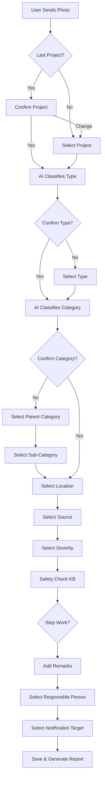

# HSE Observation Reporting Flow Specification

This document details the complete flow for reporting a Health, Safety, and Environment (HSE) observation via the WhatsApp bot, including all conditionals, fallbacks, and system logic.

## 1. Initiation & Identification
**Trigger**: User sends a photo (optionally with caption).

### Step 1.1: Image Analysis (AI)
- **Input**: User photo + caption.
- **Process**:
    - AI analyzes image for hazards.
    - AI identifies:
        - **Project Name** (if recognizable/text present or from user history).
        - **Observation Type** (Unsafe Act / Unsafe Condition / Near Miss).
        - **Hazard Category** (e.g., Working at Height, Electrical).
        - **Description**.

### Step 1.2: Project Selection
- **Logic**:
    - **Scenario A: User has history**:
        - System retrieves last selected Project ID.
        - **Prompt**: "I see this is for [Last Project Name]. Is this correct?"
        - **Options**:
            - [Yes] -> Proceed to *Observation Type*.
            - [Change Project] -> Go to Scenario B.
    - **Scenario B: New User / Change Project**:
        - **Prompt**: "Please select the Project:"
        - **Options**: List of active projects (Interactive List Message).
        - **Selection**: User picks from list.
        - **Fallback**: If list > 10, show top 10 + "More" or allow text search.

## 2. Classification & Details

### Step 2.1: Observation Type Verification
- **Logic**:
    - System uses AI-determined type (UA/UC/NM).
    - **Prompt**: "I identified a [Observation Type]. Is this correct?"
    - **Options**:
        - [Yes] -> Proceed to *Hazard Category*.
        - [Change Type] -> Show list (Unsafe Act, Unsafe Condition, Near Miss, Good Practice).

### Step 2.2: Hazard Category Verification
- **Logic**:
    - System uses AI-determined category.
    - **Display**: Shows **Category Name** only (e.g., "Confined Spaces"). Codes (e.g., "A1") are hidden for cleaner UX.
    - **Prompt**: "It looks like [Category Name]. Is this correct?"
    - **Options**:
        - [Yes] -> Proceed to *Location*.
        - [No / Change Category] -> **Hierarchical Selection Flow**:
            1. **Parent Selection**:
                - **Prompt**: "Please select the *Main Category*:"
                - **Options**: [Safety] / [Environment] / [Health]
            2. **Sub-category Selection**:
                - **Prompt**: "Please select the *[Parent]* sub-category:"
                - **Options**: Interactive list of relevant sub-categories (paginated if > 9).
                - **Data Source**: Categories text/codes are managed via the Frontend Configuration (`SafetyConfig`).
            3. **Selection**: User picks one.

### Step 2.3: Location
- **Logic**:
    - **Prompt**: "Where is the location?"
    - **Options**:
        - [Share Location] (WhatsApp Location Pin).
        - [Select from List] (Pre-defined locations for the Project).
        - [Type Manually] (Free text).

### Step 2.4: Breach Source
- **Logic**:
    - **Prompt**: "Who/What is the source of the breach?"
    - **Options**: List of Subcontractors, Teams, or Equipment types.
    - **Selection**: User picks from list or types manually.

## 3. Risk Assessment & Action

### Step 3.1: Severity
- **Logic**:
    - **Prompt**: "Rate the severity:"
    - **Options**: [High] / [Medium] / [Low].

### Step 3.2: Safety Check (AI/KB)
- **Process**:
    - System queries Safety Knowledge Base (RAG) using:
        - Category
        - Severity
        - Description
    - System retrieves specific safety protocol/advice.

### Step 3.3: Stop Work
- **Logic**:
    - **Prompt**: 
        - Show Safety Advice (e.g., "Ensure fall protection is in place.").
        - "Do you need to stop work immediately?"
    - **Options**:
        - [Yes]
        - [No]

### Step 3.4: Remarks
- **Logic**:
    - **Prompt**: "Please add any additional remarks or details."
    - **Input**: Free text.
    - **Note**: Optional step (can skip if empty, but good to prompt).

## 4. Finalization & Notification

### Step 4.1: Responsible Person
- **Logic**:
    - **Prompt**: "Who is the responsible person?"
    - **Options**:
        - List of Site Engineers / Supervisors (linked to Project).
    - **Selection**: User picks from list.

### Step 4.2: Stakeholder Notification
- **Logic**:
    - **Prompt**: "Who should be notified about this report?"
    - **Options**: List of Project Managers / HSE Officers.
    - **Multi-select**: (Ideally yes, but WhatsApp list is single select. Flow might ask "Anyone else?" loop or select primary).
    - **Default**: select primary notification target.

### Step 4.3: Summary & Submission
- **Process**:
    - Save Report to Database (DynamoDB).
    - Status: `OPEN`.
    - Generate Report Number (e.g., HSE-2023-001).
- **Output**:
    - Send Summary Card to User:
        - Photo
        - Reference #
        - Summary of all fields.
    - Start notification workflow (email/WhatsApp to stakeholders).

## 5. System Configuration
**Frontend Management**:
- **Hazard Categories**: Admins can manage the taxonomy via the `SafetyConfig` dashboard.
    - Capabilities: Add, Edit, Delete Categories.
    - Fields: `Code` (e.g., A1), `Name` (e.g., Confined Spaces), `Parent Category` (Safety/Environment/Health).
- **Projects**: Manage active projects and their locations.

## 6. Flow Diagram Logic (Summary)

